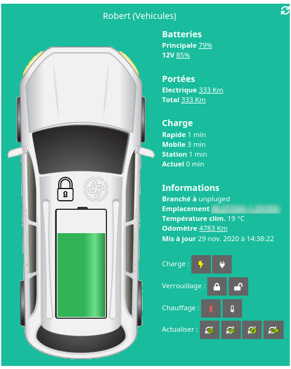
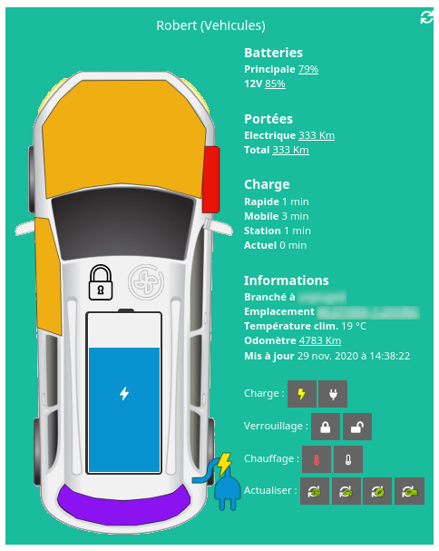

# Plugin Kia UVO

## Présentation

Ce plugin Jeedom `kiauvo` permet d'obtenir les valeurs d'un (ou plusieurs) véhicules de la marque Kia compatible  avec le système [UVO](https://www.kia.com/fr/service/uvo-connect/). Il permet aussi de piloter quelques action simples.

## Avertissement

- Il utilise la librairie `kuvork` sous le capot, tous les problèmes liés à cette bibliothèque ne seront pas gérés ici,
- Les actions sont gérées par UVO et peuvent prendre un certain temps à s'appliquer à la voiture,
- :warning: lorsque vous chargez les données directement depuis le véhicule (`rafraîchir depuis le véhicule`) ce dernier sort de son cycle de veille pendant quelques minutes (d'après mes tests 3 minutes) en utilisant la batterie 12V. Un abus de cette fonctionnalité est capable de décharger votre batterie. A utiliser donc sans abus et à vos risques et périls ! Ce problème est aussi remonté sur le plugin équivalent pour [Homey](https://github.com/gruijter/com.gruijter.hyundai_kia#how-to-get-live-status-updates).
- Les serveurs UVO utilisés par cette application limitent le nombre de requêtes par heure à 100. Cette limitation semble être définie par adresse IP.

## Installation

Après le téléchargement du plugin, rendez vous sur sa page de configuration et activez le.

Par suite assurez vous que les dépendances soit bien installés. Elles sont nécessaire pour le démarrage du demon `UVO`. Si le statut est `NOK`, pensez à relancer l'installation. 

> En fonction de votre environnement et de votre connexion internet, ceci prendra de quelques secondes à une dixaine minutes (Raspberry 3 et ADSL 3Mb/s).

## Configuration

Pour cette partie vous devez déjà avoir connecté et configurer votre véhicule à l'application UVO. Pour celà reportez vous au manuel du constructeur [disponnible ici](http://webmanual.kia.com/STD_GEN5_WIDE/AVNT/EU/French/beforeusinguvoeservices.html).

Dans la configuration du plugin, entrez les informations nécessaire au forctionnement du plugin: 

- Utilisateur : L'**email** de l'utilisateur de UVO
- Mot de passe : Le **mot de passe** UVO
- Région : La région dans laquelle se trouve votre véhicule
- Langue : La langue de votre application UVO (uniquement en europe)
- Pin : Le **code de sécurité** de votre véhicule
- Port : Le port applicatif du démon (**réservé aux utilisateur avancés**)
- Véhicules de test : Le nombre de véhicules virtuels ajouté par le démon

> Ces informations sont stoqués sur votre Jeedom et sont exclusivement utilisés par le demon UVO dans le cadre de ses interactions avec le system UVO et le véhicule.

Une fois configuré, cliquez sur `sauvegarder`.

Finalement, assurez vous que le demon démare bien. Cliquez sur le bouton `(Re)Démarer` et assurez vous que le statut soit sur `OK`. Il est aussi fortement recommandé d'activer la `Gestion automatique` ; elle permet à Jeedom de lancer automatiquement le démon au démarrage de Jeedom, ainsi que de le relancer en cas de problème.

## Configuration des véhicules

L'accès à la configuration du véhicule est possible via le menu plugin :

Cliquez sur ajouter et donez un nom a votre véhicule. Vous serez redirigez vers la fiche du véhicule. Vous y retrouvez les options habituels Jeedom ainsi que la configuration propre du véhicule.

### Option du véhicule

Commencez par choisir votre véhicle (`Identifiant véhicule`) parmis la liste de ceux proposés. Cette liste reprend les véhicules référencés sur votre compte UVO.

Le paramère `Source d'énergie` vous permet de choisir le type de motorisation de votre véhicule. En fonction de ce choix, les widgets auront une apparence différente (affichage de la batterie pour les véhicules électriques par exemple).

Le paramère `Capacité de la batterie` n'est pas encore utilisé à ce jour.

Le paramètre `Options du widget` permet de configurer les actions visibles sur le widget. En fonction de votre véhicule et des options disponible sur votre forfait UVO, il est possible que toutes ne soient pas disponibles. Vous pouvez donc les désactiver ici.

### Option d'actualisation des données

Pour désactiver un des rafraichissements, vous pouvez définir l'option en question à `0`.

Le paramère `Fréquence de mise à jour depuis UVO` vous permet de définir à quel rythme Jeedom lis les information du véhicule depuis le service UVO.

Le paramère `Fréquence de mise à jour depuis le véhicule` vous permet de définir à quel rythme Jeedom lis les informations depuis le véhicule.

Le paramère `Fréquence de mise à jour de l'odomètre` vous permet de définir à quel rythme Jeedom lis les informations de l'odomètre du véhicule.

Le paramère `Fréquence de mise à jour de la position` vous permet de définir à quel rythme Jeedom lis les informations de localisation du véhicule.

Le paramère `Fréquence de mise en mode live` vous permet de définir à quel rythme Jeedom récupère les informations du véhicule quand le mode live est actif sur le véhicule. Pour en savoir plus, referez vous à la section `live` de cette documentation.

> NB: pour cela le plugin ne contacte pas le véhicule mais le système UVO. Cela permet entre autre de ne pas user la batterie 12V du véhicule. Quand il roule, le véhicule dois envoyer de lui même régulièrement des informations au système UVO.

Noubliez pas de sauvegarder vos modifications.

> C'est au moment de la sauvegarde que les commandes sont crées.

## Informations

### Localisation

- `altitude`: Altitude du véhicule en m
- `direction`: direction du véhicule en °
- `latitude`: La latitude du véhicule
- `longitude`: La longitude du véhicule
- `vitesse`: La vitesse du véhicule

### Moteur

- `charge batterie principale`: Niveau de charge de la batterie principale (pour les véhicules à énergie electrique)
- `charge batterie secondaire` : Niveau de charge de la batterie 12V
- `en charge` : Si le véhicule est en charge (pour les véhicules à énergie electrique)
- `régulateur de vitesse adaptatif` : Si le système de régulation de vitesse adaptatif est en marche
- `branchée` : Le véhicule est-il branché (pour les véhicules à énergie electrique)
- `branché à` : A quoi le véhicule est il branché (pour les véhicules à énergie electrique)
- `limite de charge` : La limite de charge du véhicule pour une charge standard (pour les véhicules à énergie electrique)
- `limite de charge rapide` : La limite de charge du véhicule pour une charge rapide (pour les véhicules à énergie electrique)
- `temps estimé de charge` : Temps de charge estimé pour la charge en cours
- `temps estimé de charge rapide` : Temps de charge sur une borne de charge rapide
- `temps estimé de charge portable` : Temps de charge sur le sytème de charge 220V
- `temps estimé de charge sur borne` : Temps de charge sur une borne
- `portée totale` : Distance totale que le véhicule peut parcourir
- `portée électrique` : Distance que le véhicule peut parcourir sur sa batterie
- `portée carburant` : Distance que le véhicule peut parcourir avec son niveau de carburant
- `sur la route` : Le moteur est-il démaré

### Chauffage

- `climatisation`: Si la climation est active
- `chauffage volant` : Si le chauffage du volant est actif
- `dégivrage rétroviseurs` : Si le dégivrage des rétroviseurs est actif
- `dégivrage vitre arrière` : Si le dégivrage de la vitre arrière est actif
- `dégivrage vitre avant` : SI le dégivrage / désembuage de la vitre avant est actif
- `temperatureSetpoint` : La température définie dans l'habitacle
- `consigne température` : La température de consigne pour le conditiennement du véhicule
- `consigne dégivrage` : La consigne de dégivrage pour le conditionnement du véhicule
- `consigne chauffage` : La consigne de chauffage pour le conditionnement du véhicule

### Chassis

- `ouverture capot`: Si le capot est ouvert
- `ouverture coffre` : Si le coffre est ouvert
- `vérouillage` : Si les portes sont vérouillés
- `ouverture porte avant droite` : Si la porte avant droite est ouverte
- `ouverture porte avant gauche` : Idem avant gauche
- `ouverture porte arrière gauche` : Idem arrière gauche
- `ouverture porte arrière droite` : Idem arrière droite
- `témoin pression pneu avant droit` : Si le témoin de pession avant droit est allumé
- `témoin pression pneu avant gauche` : Idem avant gauche
- `témoin pression pneu arrière droit` : Idem arrière droit
- `témoin pression pneu arrière gauche` : Idem arrière gauche
- `tous les témoins de pression pneu` : Si tous les temoins de pression sont allumés (UVO précise cette valeur)
- `odomètre` : Le nombre de kilomètres parcouru par le véhicule

## Actions

- `démarrer la charge` : Lancer une session de charge (pour les véhicules à énergie electriques)
- `stopCharging` : Arréter la charge en cours (pour les véhicules à énergie electriques)
- `verrouiller` : Verrouiller les portes
- `déverrouiller` : Déverrouiller les portes
- `desactiver le préchauffage` : Arréter le préchauffage
- `activer le préchauffage` : Lancer le préchauffage du véhicule
- `rafraîchir depuis UVO` : Rafraichir les données depuis le système UVO
- `rafraîchir depuis le véhicule` : Rafraichir les données depuis le véhicule (:warning: tire sur la batterie 12V)
- `rafraîchir la position` : Rafraichir les données de localisation du véhicule (:warning: tire sur la batterie 12V)
- `rafraîchir l'odomètre` : Rafraichir les données de l'odomètre (:warning: tire sur la batterie 12V)
- `activer le mode live` : Activer la remonté d'informations en live
- `désactiver le mode live` : Arréter la remontée live d'informations
- `définir consigne température` : Définir la température de consigne (un chiffre en °C entre 14 et 30)
- `définir consigne dégivrage` : Définir la consigne de dégivrage (0 ou 1)
- `définir consigne chauffage` : Définir la consigne de chauffage (0 ou 1)
- `définir la limite de charge rapide` : Définir la limite de charge rapide (50, 60, 70, 80 ou 100%)
- `définir la limite de charge` : Définir la limite de charge standard (50, 60, 70, 80 ou 100%)

## Widget

Le plugin met à disposition un widget, ce dernier active ou désactive des fonctionnalités en fonction de la source d'énergie configurée sur le véhicule. Il se met aussi automatique à jours quand une nouvelle donnée est disponnible.

On y retrouve les informations chiffrés et textuels énnumérés ci-dessus dans la partie de droite, et les informations d'état (de manire visuelle donc) dans la partie de gauche. Les actions sont elles aussi disponnibles.

Voici un exemple ou:

- Le témoin avant droit est allumé
- Le capot est levé
- La portière avant gauche est ouverte
- Le dégivrage arrière est en marche
- Le cordon de charge est branché
- La charge est en cours

## Scénario de préchauffage

Si vous partez a heure fixe, vous pouvez utiliser le plugin Agenda pour pré-conditionner votre véhicule. Afin que la température y soit a votre goût, en été comme en hiver, configurez un scénario comme suit.

Définissez avnt tout vos consignes, puis lancez la chauffe.

## Mode live

Le mode live permet de remonter les informations plus régulièrement quand le véhicule est en marche, pour celà le rafraîchissement depuis le véhicule est utilisé au rythme définis par le paramètre `Fréquence de mise en mode live`. Le mode live se désactive quand le véhicule est de nouveau à l'arret, ou quand une commande est déclenchée, soit via le widget soit via un scénario. Le mode live ne démare toutefois pas seul, il nécessite une action externe.

## Mode démo

Il es possible d'utiliser le plugin en mode démo, sans se connecter aux serveurs de la marque de véhicule. Ce mode est généralement utilisé pour raliser une démonstration du plugin ou pour tester des comportements. Afin de l'utiliser, vous devez : 

- Utiliser le nom d'utilisateur : `demo@jeedom-plugin.com`
- Utiliser le mot de passe : `D€m0JeED0M`

### Manuellement

En utilisant l'application mobile ou l'application web de Jeedom, vous pouvez cliquer manuellement sur le bouton `Démarer` dans la section `Live` des actions.

### Api

Jeesom dispose d'une API externe documentée ici: https://doc.jeedom.com/fr_FR/core/4.0/api_http, qui vous permettera de déclencer la commande voulue depuis le média de votre choix.

### Apairage Bluetooth

Sur Android et iOS, il existe des applications capable de déclencher automatiquement Jeedom pour qu'il commence à recevoir des mises à jour en direct dès que votre téléphone se connecte au Bluetooth de la voiture.

#### Android

Il existe plusieurs applications qui peuvent faire cela. Pour Android, regardez [Automate](https://play.google.com/store/apps/details?id=com.llamalab.automate) et adaptez ce [flux](https://llamalab.com/automate/community/flows/37829) pour qu'il corresponde au Bluetooth de votre propre voiture et aux URL fournis dans l'onglet `Live` de la configuration de votre véhicule. Il est nécessaire de remplacer dans les urls dans les deux premiers blocs, et de choisir le périphérique Bluetooth sur le premier block de vérification de connexion.

#### iOS

Pour iOS, regardez au niveau de [Shortcuts](https://apps.apple.com/app/id915249334). Créez un `Shortcut` qui détecte l'état du Bluetooth et qui appel les urls fournis dans l'onglet `Live` de la configuration de votre véhicule, ou, adaptez ce [flux plus complexe](./medias/Jeedom+kiauvo+Bluetooth+live.png).

## Problèmes

### Le démon démare quelques secondes puis s'arrète

Il est probable qu'il s'agisse d'un problème d'authentification. Pour en savoir plus, rendez-vous dans l'interface de configuration du plugin et consultez les logs du démon `kiauvo_node`.

Si le texte `'Deamon kiauvo_node started'` n'y apparaît pas, c'est que le démon n'arrive pas à accéder aux serveurs UVO.

Deux messages d'erreurs sont alors possibles : 

`Bad credentials! Could not connect to UVO with user/password` => le nom d'utilisateur ou le mot de passe sont mal configurés.
`Bad credentials! Could not connect to vehicle with pin` => la valeur du code pin n'est pas correcte.

Assurez vous que l'email de l'utilisateur ainsi que son mot de passe sont correctement renseignés et que le code pin est le bon.

Si le problème persiste, il est possible que le problème soit lié à l'authentification avec les serveurs UVO. Commencez par vous assurer que vous arrivez bien à vous connecter à cette url : [Login CCAPi KIA](https://prd.eu-ccapi.kia.com:8080/api/v1/user/oauth2/authorize?response_type=code&state=test&client_id=fdc85c00-0a2f-4c64-bcb4-2cfb1500730a&redirect_uri=https://prd.eu-ccapi.kia.com:8080/api/v1/user/oauth2/redirect). Si ce n'est pas le cas une procédure pour activer ou réactiver le compte vous sera proposé. Si vous arrivez sur une page blanche, c'est que vos identifiants sont les bons.

Redémarrez ensuite le démon.

### La position de mon véhicule est NaN, NaN

La valeur d’emplacement est calculée à la création du véhicule, puis régulièrement pour chaque période de temps configurée pour ce véhicule sous le paramètre `Fréquence de mise à jour de la position`. Si ce dernier est à zéro, ou que la période n’est pas encore écoulée, il est possible que la valeur précédente reste. Il est possible de l’actualiser en lançant la commande `rafraîchir la position` ou via le bouton `Actualiser la position` du widget.